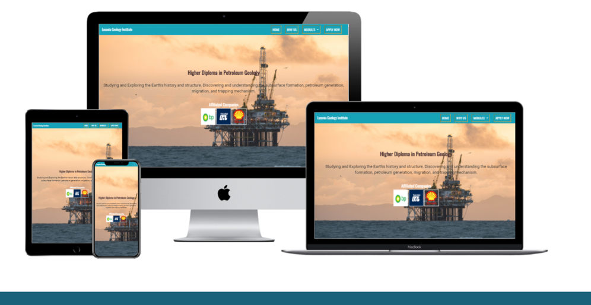

# Luconia Geology Institute
The primary goal of Luconia Geology Institution is to offer a diploma course in Petroleum Geology. 
The target audiences of Luconia Geology Institution are Pre-U student and experienced workers who wish to switch their 
career into petroleum geology sector. 

The webpage will shows the selling points and advantages of taking this diploma course in terms of the user's future career pathway. 
 

# **User Experience (UX)**

### **Player goals**

* Course that is focusing mainly in petroleum geology sector.
* A detail description of the modules.
* The modules provided are easy to navigate with a click.
* Fascinating lectures and practical work.
* The contents are clearly arranged. 

Luconia Geology Institution provides the essential courses that fulfill the players' need as in: 

* Available modules outlines are easily glanced as the user browses the website at the first time. 
* The reasons for choosing Luconia Geology Institution are clearly shown in the home page. 
* A detail description of the modules provided are created in a different webpages.   

### **Developer and Business Goals**

 * Well-structured content created from programmming that provides a user-friendly webpage of Luconia Geology Institution.
 * A junior developer using HTML and CSS to showcase the coding skill and as a first portfolio. 

### **User Stories**

 1. I want to know the main content and the purpose of the site trying to show. 
 2. I want to know the modules outline easily with a glance without using much time on searching them on the site.
 3. I want to know the details of each modules that offered by the site which can be shown clearly and in an order arrangement.
 4. I want to know the competitive level of the course as compare to the other sites so it is worth the cost.
 5. I want to locate the affiliated companies which the institute is collaborated with. 
 6. I want to see their posts on social media to assure the credibility. 
 7. I want the easiest way to contact the institute for further queries and sign up.  

### **Design Choices**

* Imagery 
    * The main background image in the home page is using a large image of an offshore rig. The idea of using this offshore rig picture
    is to catch user's attention. It gives a feeling of relation between the course and the potential future employment environment.
    * The modules backgrounds are set to be geology related because those images are the real example of a study cases which fit into each modules respectively.
* Color Scheme
    * The main colors used are dark cyan for the navigation bar and institute title, and teal blue color for the bottom footer section. 
    * White color is used for the title and text to give a contrast so it is easy for the user to read. 
    * Lightning yellow color is used for the top navigation link when these links are hovered which present a great contrast to the navigation color. 
* Typography
    * Oswald and Roboto font are the main font used throughout the whole website with Sans Serif as the fallback font in case the font is not being imported correctly to the site.
    * Oswald and Roboto font look good in a wide range of screens which are mobile, tablet, and dekstop.  
* Styling
    * Each of the links/pages has the same navigation menu so the user can direct to the other main navigation sites when they are browing a particular links.
    * Each of the links/pages has the background image to show the consistency throughout the webpages. 
    * Each of the links/pages has the contact information and social media links so the user can acquired the information of the institute easily.
### **Wireframes**

Balsamiq were used to create these following wireframes while planning the project and the Scope Plan section. 

* [Home](wireframes/home.png)
* [Sign Up](wireframes/sign-up.png)
* [Why Us](wireframes/why-us.png)
* [Reservoir Engineer](reservoir-engineer/home.png)
* [Basin Analysis](wireframes/basin-analysis.png)
* [Seismic Interpretation](wireframes/seismic-interpretation.png)

# **Features**

Each page consists of a responsive navigation bar sitting at the top page. The branding of the website is located on the top left, whereas the navigation links is situated on the top right. Each page consists of a footer 
with the contact and location details of the institute, together with the social media icons linking to each social media platform.  

The navigation links comprise of home page, why us page, modules page, and sign up page. Each of this page features a specific main background image to match the information that the particular page is trying to show to the audience. Those images 
contain the upper half of the webpage.

Home

The Home page features a main background image of an offshore rig which contain the landing page. This idea is to give the audience an visual impact and relate this image to the course provided by the institute. All the navigation links are shown 
at the top right position with a white font color to give contrast to the the cyan background color. The title of the course is shown in the landing page which can be seen easily following by a brief description of the course structure. 
The navigation links are consistent across desktop, laptop, and tablet resolution, whereas a menu bar is shown in mobile resolution to fit the relatively small screen size. The affiliated company logos are shown as well and featured with 
links so the user can search for more information about the partner company by directing to a new page.  

After the affiliated company logos are the modules section which the insitute is offering. They are aligned side by side with the name of the modules attached. Each of the module has a background image that are relating to the course. A link right below as named: "Read More"
is shown so the user can direct to the module page by a click to explore the details of the course. An easy navigation is vital for the user so the navigation bar is fixed at top, hence it is always shown when the user scrolls down the page. 

Why Us

The Why Us page features a main image showing a group of students working together in a library with book racks behind them which indicates the study environment of the institute. The page consists of the three reasons 
of choosing the institute. Each reason section has a small image and a description. These reasons are to show to the user the advantages of choosing this institute in terms of learning, funding, and internship opportunity.
In mobile resolution, the images which are placed right beside the description are hidden to conserve the limited space on a mobile screen size and shows only the important description to the user.  
 
Modules

The modules link is shown as a dropdown in the navigation bar. Each of the module is shown accordingly when the user clicks on the modules link. The three modules has their own webpage with an background image and the module title 
wrap within the image. The middle section of the page is the module detail. The user can get to know what are the learning outcomes and how does this modules help to level up their competitiveness.  
 
Apply Now

The Apply Now page features a contact form which requires the user to fill up their name, email, phone number, username, and password. The bottom of the form consists of a submit button which named as **Register Now**. The forms are aligned on top of each other in mobile resolution. 

### **Existing Features**

* Header Brand - Appears on every page. It allows all the users to spot it easily since it is placed at the top left of the webpage. 
* Header Navigation Bar - Appears on every page. It allows all the users to navigate to different website's pages and their content easily. 
* Hover - Appears on navigation bar. The style of each links change upon the user interaction as they hover their cursor over it or clicking on it.
* Footer Social Icons - Appears on every page. It allows all the users to browse the social media platform that the institute uses. 
* Footer Contact Info - Appears on every page. It allows all the users to reach to the institute via calling the number and email. The number and email are set as a link format so the users can click on it and it will direct them to either phone calling interface or email interface.
* [Why Us Page](https://github.com/kenweechin/luconia-geology-institute/blob/master/why_us.html) - Allows the users to know the pros of taking the course offer from the institute.
* [Modules Page - Basin Analysis](https://github.com/kenweechin/luconia-geology-institute/blob/master/basin_analysis.html) - Allows the users to understand what is basin analysis.
* [Modules Page - Reservoir Engineer](https://github.com/kenweechin/luconia-geology-institute/blob/master/reservoir_engineer.html) - Allows the users to understand what is reservoir engineer.
* [Modules Page - Seismic Interpretation](https://github.com/kenweechin/luconia-geology-institute/blob/master/seismic-interpretation.html) - Allows the users to understand what is seismic interpretation.
* [Apply Now Page](https://github.com/kenweechin/luconia-geology-institute/blob/master/sign_up.html) - Allows users to proceed their first step of registration with the institute.  

### **Features left to implement**
* Subscriber opt-in pop-up screen - Allows all new users to have an option to sign up for the email newsletter to receive any annoucement from the institute. 
* Add english proficiency testing to sign up form. Users will have to key in their IELTS score to check if they meet the minimum requirement.
* Academic calender - Shows the timeline of in-class, field-work, and internship period. 
* Feedback pop up form - Use to capture insights of the user experience. 

# **Technologies Used**
* HTML and CSS programming languages are used in this project. 
* The developer uses [Gitpod](https://www.gitpod.io/) for their integreted development environmet (IDE) which can be launched from [Github](https://github.com/) to build the website.
* [BoostrapCDN](https://www.bootstrapcdn.com/) - Used to provide website's structure and makes the website to be responsive across different screen resolution. Furthermore, it provides icons from [FontAwesome](https://www.bootstrapcdn.com/fontawesome/).
* [Google Fonts](https://fonts.google.com/) - *Roboto* and *Oswald* font family were imported to style the website fonts.
* [jQuery](https://jquery.com/) - For responsive navbar. 
* [Popper.js](https://popper.js.org/) - For responsive navbar. 

# **Testing**
Testing documentation is created in [TESTING.md file](https://github.com/kenweechin/luconia-geology-institute/blob/master/TESTING.md)

# **Deployment**
This project is developed using [Gitpod](https://www.gitpod.io/), commited to git, and pushed to [GitHub](https://github.com/) via the build in function in gitpod. The detail steps are stated as below:
1. Git add filename - This command was used to add selected files to the staging area before commiting. 
2. Git commit -m *commit message stating the updates* - This command was used to commit changes to the local repository. 
3. Git push - This command is used to push all commited changes to Github repository and all the files are safe.  

The steps to deploy the page to Github Pages from its GitHub repository are shown as below:
1. Log in to Github.
2. Choose **kenweechin/luconia-geology-institute** from the list of repository.
3. Click on **Setting** on the right of the menu section near the top page.
4. Navigate to the **Pages** in the left sidebar and click on it.
5. Under **GitHub Pages**, use the **Branch** or **None** dropdown menu, then select Master Branch. 
6. Click on **Save** button on the right, and the website is now deployed.   

### **The methods to run this project locally**
1. 