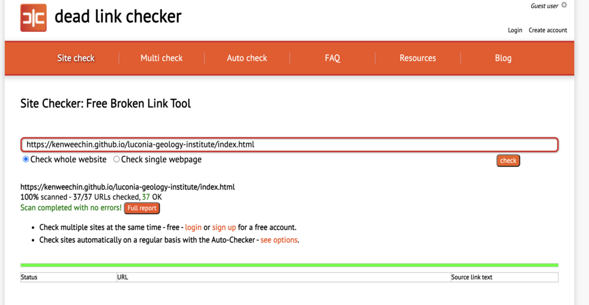

# Luconia Geology Institute - Testing details
* [Main README.md file](https://github.com/kenweechin/luconia-geology-institute/blob/master/README.md)
* [Website in Github Pages](https://github.com/kenweechin/luconia-geology-institute)

# Testing
* [W3C Markup Validation](https://validator.w3.org/)
* [W3C CSS Validation](https://jigsaw.w3.org/css-validator/)
    * W3C Markup Validation and W3C CSS Validation were used by the developer to validate the website code. 
* The project was tested and verify there is no broken link as shown by the image as below: 
]

### **Client Stories Testing Section.**

* The pathway across the website is shown as below: 
    * Home -> Why Us -> Modules -> Apply Now
    * Each page shows the exact information that the developer wants the clients to receive. The paths / nav links are consistent and always visible to the client's eye on different pages so they can navigate to other links easily.  

* Testing from UX section of README.md
    1.  As a new visitor to the webpage, I would like to know:
        * The course the website is offering at the first glance.
        * The name of the institute is apparent.
        * A background image that is relevant to the nature of the course. 
        * The navigation bar is always visible wherever I am scrolling to a different section of the page.
        * The home page link is easy to find which lead back to the main page. 
    
    2.  As a new visitor to the webpage, I would like to know:
        * The modules which offering by the institute. 
        * The modules links are easy to navigate, either on top of the webpage or within the content of the webpage.
        * The outlines of the modules are arranged and shown. 

    3. As a potential client, I would like to know what are the petroleum geology-related modules are offering.
        * There are two sections where the clients can navigate the modules links, first at top of the navigation bar, and the other section is at the middle of the home page. The client can click the link and will direct to each modules page which shows a thorough description of the structure of the module.
        * A new tab will open up when the clients click on the link while keeping the current page open up. 

    4. As a potential client, I would like to know why should I choose the course offers by this institute.
        * In the landing page, the industry companies logos are shown so the client knows there is a partnership between the institute and the oil industry.
        * The logo of the companies is a link where the client can click on it which then direct them to the particular company's website to understand their role in the oil industry.
        * A new tab will open up when the clients click on the link while keeping the current page open up.
        * Client get to know what makes the course offered to be competitive on the Why Us page. This page shows the funding from the affiliated company, field trip, and internship opportunity. 
    
    5. As a potential client, I would like to follow the institute's social media to see any feedback leave by the other students, and their updated news.
        * There are 5 social media icons in the footer section/bottom page. This can be seen on every page so the client can click on it whenever they have finished browsing the page and want to check out the social media platform.
    
    6. As an interested client, I would like to find the easiest way to sign up for the course. 
        * The Apply Now link is visible and clearly labelled on every page. 
    
### **Manual testing of all functionality and elements on every page created.**   
* Home Page:
     1. Navigation bar: 
        * Go to the "Home" page in a desktop resolution.
        * Adjust the screen size from desktop to tablet to validate the navigation menu items remain and all the menu stay at a consistent width between each other. Furthermore, also verify the texts are aligned in the centre without changing their position.
        * Checking there is no overflow for each inline menu that causes themselves to extend outside the navigation bar.  
        * Hover over the navigation menu items and verify all of the links change colour to indicate the pointing of the cursor, and the border transitions are expected.
        * Click on the "Home" link to verify links to the home / main page. 
        * Click on each navigation menu items to verify each link are navigate to the right page.
        * Hover over the links that appear on the background image and verify each of the links work and is opening up to a new page.
        * Change the screen resolution too small and verify the inline menu switches to burger icon dropdown menu at the correct position, the navigation menu items have no coloured border around them.
        * In the small screen resolution, verify the logos are centred and the texts font-size are reduced slightly smaller centred as well.
        * Repeat responsiveness and testing functionality verification for mobile resolution. 
    
    2. Main background image:
        * Go to the "Home" page in a desktop resolution.
        * Verify the image contain the landing page. 
        * Reduce the screen size and the image containment retain.
    
    2. Modules image:
        * Go to the "Home" page in a desktop resolution.
        * Checking the modules images are aligned side by side with equal spacing.
        * Reduce the screen resolution to tablet screen size and verify the modules images remain in the same position and spacing.
        * Verify the links "Read More!" under each modules images are working and navigating to the right page.
        * Reduce the screen resolution to mobile screen size and verify the modules images are now aligned on top of each other instead of side by side. 
        * Verify the size of the modules images are graduall decreases as the screen size reduces.  
        * Verify the position of the modules images is centre aligned in mobile screen size with equal blank space on each side.
    
    3. Footer:
        * Go to the "Home" page in a desktop resolution.
        * Hover over to telephone number and email address under contact info and each social media icons and verify they are opening up a separate tab by clicking on them.
        * Reduce window to mobile screen size and verify the "Contact Info" section is lying on top of the "Follow Us" section.
        * Verify the social links are remain inline as the width of windows reduced.

* Why Us Page:
    1. Navigation bar: 
        * Navigation bar code is the same on all HTML pages. Testing is verified and done.
    
    2. Webpage top part background image:
        * Go to the "Home" page in a desktop resolution.
        * Verify the image contain the upper portion of the landing page. 
        * Reduce the screen size and the image containment retain.
    
    3. Page images:
        * Go to the "Home" page in a desktop resolution.
        * Verify the images are aligned properly and on top of each other with equal width and size.  
        * Reduce the width of the window and verify the images' position retain and look good from desktop to tablet screen size.
    
    4. Page content:
        * Adjust the width of the window to verify the text's position are remain in the container from desktop to tablet screen resolution, and they do not overflow when the screen size is reduced. 
        * Reduce the screen size to mobile resolution and verify the page images are disappear to conserve the space and left only the texts. 
    
    5. Footer 
        * Footer code is the same on all HTML pages.
        * Verification is done for the footer on the Home page.

* Modules Page:
    1. Basin Analysis Page:
       * 1a.  Navigation bar: 
            * Navigation bar code is the same on all HTML pages. Testing is verified and done.
           
       * 1b. Webpage top part background image:
            * Repeat verification steps done for Why us page. 
        
       * 1c. Header 1 text:
            * Adjust the window width from desktop to mobile resolution to verify the header text always aligned in the centre. 
    
       * 1d. Header 2 text:
            * Repeat the window width adjustment and verify the text is maintained at the same position and aligned together with the article below.
    
       * 1e. Page content:
            * Adjust the window width from desktop to mobile resolution to verify the content always aligned in the centre and equal spacing on both sides.
    
       * 1f. Footer:
            * Footer code is the same on all HTML pages.
            * Verification is done for the footer on the Home page.
    
    2. Reservoir Engineer Page:
        * All sections were tested and verified. Testing steps are the same as to Basin Analysis Page.
    
    3. Seismic Interpretation Page:
        * All sections were tested and verified. Testing steps are the same as to Basin Analysis Page.

* Apply Now Page:
    1. Navigation bar: 
        * Navigation bar code is the same on all HTML pages. Testing is verified and done.
    
    2. Webpage top part background image:
        * Repeat verification steps done for Why us page. 
    
    3. Sign Up form:
       * Testing 1: Submit empty form and verify that an error appears showing fill up is required.
       * Testing 2: Submit an invalid email address and verify that an error shows up indicating a proper format is required.
       * Testing 3: Submit empty form for phone number form and verify that fill-up the form is required. Further testing by input alphabet is not allowed.
       * Testing 4: Submit empty form for username form and verify that an error appears showing fill up is required.
       * Testing 5: Submit empty form for password form and verify that an error appears showing fill up is required. 
       * Testing 6: Submit the form by input valid data and verify that no error occurs.
       * Go to the "Home" page in a desktop resolution and reduce the screen size to tablet resolution. Verify the forms are aligned side by side (3 x 3) as expected.
       * Further reduce the screen size to mobile resolution and the forms are stacking on top of each other which is expected. 

    4. Footer:
        * Footer code is the same on all HTML pages.
        * Verification is done for the footer on the Home page.
        
          
